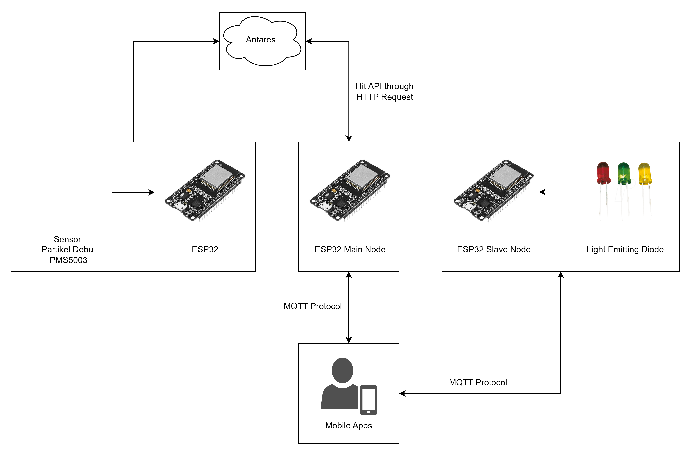

# Monitoring Emisi Debu dan Kontrol Light Emitting Diode (LED) Melalui Kodular Menggunakan Protokol MQTT dan HTTP

<!-- Deskripsi singkat proyek Anda di sini. -->

## Penjelasan Singkat

Proyek ini bertujuan meningkatkan kualitas udara dengan memantau emisi debu dan mengontrol LED secara real-time menggunakan Kodular, MQTT, dan HTTP. Motivasi utama dari proyek ini adalah adalah untuk memberikan peringatan dini, dan juga memberikan akses kepada pengguna untuk mengontrol nyala lampu secara wireless.

## Fitur

- *Fitur 1:* Monitoring Particulate Matter (PM1, PM2.5 dan PM10) melalui Aplikasi Mobile.
- *Fitur 2:* Kontrol LED menggunakan MQTT melalui Aplikasi Mobile.

## Dokumentasi

<!-- Berikut adalah beberapa tangkapan layar dari aplikasi: -->

### Diagram Blok

<!--  -->

### Aplikasi Mobile

Untuk aplikasi mobile dapat melakukan import project pada kodular menggunakan file [UASIOT.aia](https://github.com/nabilsaragih/UAS-IOT/blob/main/UASIOT.aia)

### Hasil Pengujian

Pengujian proyek dapat dilihat pada link berikut: [Monitoring Emisi Debu dan Kontrol Light Emitting Diode (LED)- Kodular APP-Protokol MQTT dan HTTP](https://youtu.be/ZvF1RYxUAPY?si=GTQaV1qftU4rcaT2)
